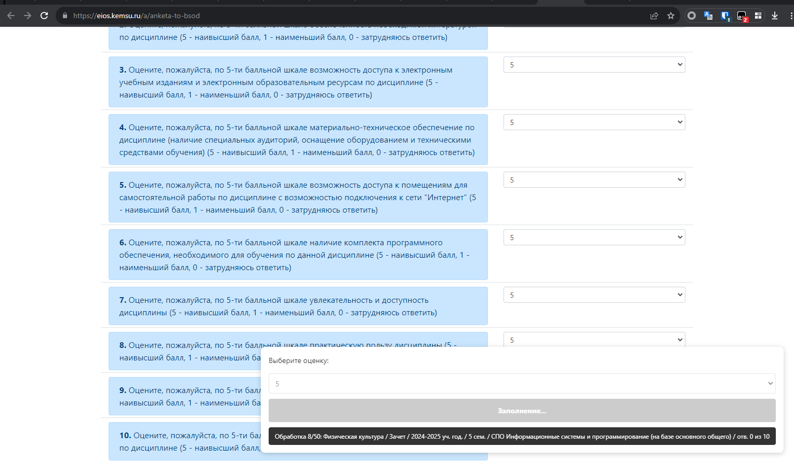

# 🚀 KemSU-BRS-AutoFill

**Автоматизация заполнения анкет БРС для Кемеровского государственного университета**

## 📌 О проекте
Пользовательский скрипт для автоматического заполнения анкет Балльно-рейтинговой системы (БРС) в КемГУ. Избавляет от рутинного выбора оценок для каждой дисциплины вручную.

## 📂 Структура файлов
| Файл | Назначение |
|------|------------|
| [`КемГУ Автозаполнение анкет БРС.user.js`](https://github.com/fleef-ru/KemSU-BRS-AutoFill/raw/refs/heads/main/%D0%9A%D0%B5%D0%BC%D0%93%D0%A3%20%D0%90%D0%B2%D1%82%D0%BE%D0%B7%D0%B0%D0%BF%D0%BE%D0%BB%D0%BD%D0%B5%D0%BD%D0%B8%D0%B5%20%D0%B0%D0%BD%D0%BA%D0%B5%D1%82%20%D0%91%D0%A0%D0%A1.user.js) | Основной скрипт для Tampermonkey |
| `LICENSE` | Лицензия MIT |
| `README.md` | Документация проекта |

## 🛠 Установка

### 📥 Способ 1: Прямая установка (рекомендуется)
1. **Установите Tampermonkey**  
     
   

2. **Активируйте скрипт**  
   → Нажмите   
   → В открывшемся Tampermonkey нажмите "Установить"

### 📦 Способ 2: Ручная установка через ZIP
1. Скачайте последний релиз: 
2. В Tampermonkey:  
   `Настройки → Утилиты → Импорт (вкладка ZIP) → Выбрать файл`
3. Выберите скачанный ZIP-архив

**Проверка установки**:  
✅ Иконка Tampermonkey должна изменить цвет  
✅ В списке скриптов появится "KemSU-BRS-AutoFill"

---

## 🖥 Использование

### 🚩 Основной сценарий
1. Откройте страницу анкет:  
   
2. Найдите панель управления в правом нижнем углу:  
   
3. **Выберите оценку** из выпадающего списка (по умолчанию: 5)
4. Нажмите ▶️ **«Заполнить анкеты»**
5. Следите за прогрессом:  
   

### 🔄 Повторное использование
• Последняя выбранная оценка сохраняется автоматически  
• Для перезапуска: обновите страницу (F5)  
• Чтобы изменить оценку: выберите новое значение перед запуском

---

## ⚙️ Особенности работы
- **Запоминание оценки** - скрипт сохраняет последний выбранный вариант между перезагрузками страницы
- **Автоповтор** - при обнаружении незаполненных полей запускает повторную попытку
- **Умный скроллинг** - автоматически прокручивает страницу к нужным элементам
- **Безопасные задержки** - имитирует поведение человека с паузами 0.2-2.5 сек

## ❗ ВАЖНОЕ ПРЕДУПРЕЖДЕНИЕ
Использование скрипта может нарушать правила вашего учебного заведения. Автор не несёт ответственности за последствия. Рекомендуется:
- Проверять заполненные анкеты
- Не выбирать оценку "0" для всех вопросов
- Использовать только для дисциплин без важных кастомных вопросов

## 🐛 Отладка и проблемы
Если скрипт не работает:
1. Обновите страницу с анкетой
2. Проверьте работу Tampermonkey на других скриптах
3. Убедитесь что не включены другие расширения, влияющие на DOM
4. Посмотрите ошибки в консоли (F12 → Console)

## 🤝 Развитие проекта
Приветствуются пул-реквесты и идеи! Основные направления для развития:
- [ ] Добавить индивидуальные настройки оценок для разных типов вопросов
- [ ] Создать систему шаблонов оценок

## 📄 Лицензия
Проект распространяется под лицензией MIT. Полный текст доступен в файле [LICENSE](LICENSE).
